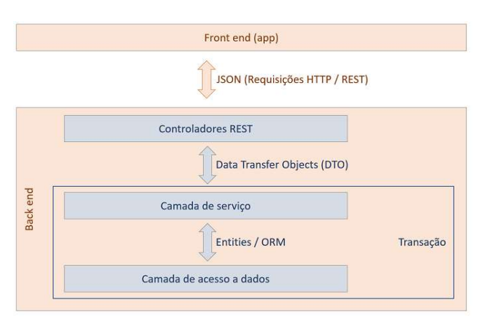
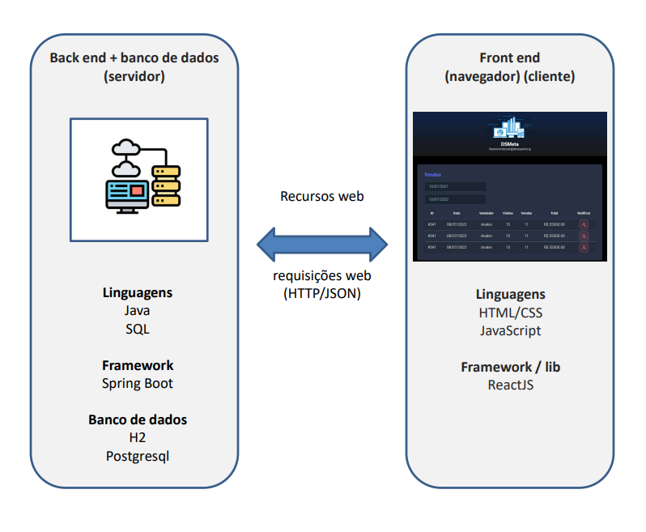

## Sistema web Top Games

> Objetivo: Gerenciar uma coleçäo de jogos

Projeto criado em Java 21/Maven, com API rest e frontend. Foi utilizado Spring (Data JPA, Postgress, Spring web, H2).

O objetivo é listar os jogos com nome e descrição.

Etapas do projeto:

* [X] Criar projeto / lib Maven
* [X] Salvar no Github
* [X] Arquivos Properties, entidade Game, ORM- Seed dos games
* [X] GameMinDTO, GameRepository,
  GameService, GameController

- [X] Implementar modelo de domínio
- [X] Atualizar seed da base de dados
- [X] GameDTO, busca game por id
- [X] Busca totas listas em /lists
- [X] Consulta SQL, projection, busca de games
  por lista
- [X] Criar os perfis de projeto *system.properties

##### Tecnologias utilizadas

* Java
* Spring Boot
* JPA /Hibernate
* Maven
* PostgreSQL
* H2

##### Como executar o projeto

Pré-requisito: Java21

```
#Clonar o projeto 

git clone https://github.com/douglas85rj/topgames.git

# executar o projeto
./mvnw spring-boot:run


```

##### Arquitetura




